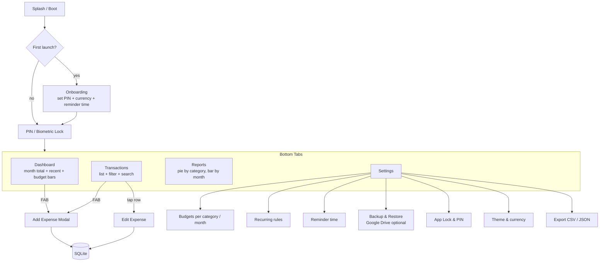

# Android Expense Manager — Plan

## 1. Confirmed Decisions

- **Stack**: React Native via **Expo (managed)** + **TypeScript**
- **Min SDK**: Android 8.0 / API 26 (Expo `android.minSdkVersion`)
- **Storage**: On-device **SQLite** (`expo-sqlite`) as source of truth + **optional, user-controlled encrypted backup to Google Drive**. No data ever leaves the device unless the user explicitly enables backup.
- **Auth**: Local PIN + biometric unlock on every cold start / background return after N minutes
- **Categories**: Predefined only (seeded at first launch)
- **Features (v1)**: Expense CRUD, monthly budgets, recurring expenses, payment-method tagging, receipt attachments, daily reminder notifications
- **Screens**: Dashboard, Transactions (list + filter + search), Reports (charts), Settings, Export, plus an Add Expense modal (FAB)
- **Theme**: Material 3 with dynamic color (Android 12+) via `react-native-paper` + `@pchmn/expo-material3-theme`; light/dark/system

## 2. Recommended Libraries

- `expo-router` — file-based navigation (tabs + modal)
- `expo-sqlite` + `drizzle-orm` — typed SQLite access & migrations
- `react-native-paper` — Material 3 components
- `@pchmn/expo-material3-theme` — dynamic color from wallpaper (Android 12+)
- `expo-local-authentication` — biometric prompt
- `expo-secure-store` — store PIN hash + Drive refresh token + DB encryption key
- `expo-notifications` — daily reminders & recurring-expense triggers
- `expo-image-picker` + `expo-file-system` — receipts (stored under app's private dir, URI saved in DB)
- `react-native-gifted-charts` — pie/bar charts (lightweight)
- `expo-sharing` + `expo-file-system` — CSV/JSON export
- `expo-auth-session` + Google Drive REST v3 (appDataFolder scope) — backup target hidden from user's Drive UI, free forever
- `crypto-js` or `expo-crypto` + AES — encrypt the backup blob with a key derived from the user's PIN

## 3. App Journey




## 4. Data Model (SQLite via Drizzle)

- `categories(id, name, icon, color, sort_order)` — seeded: Food, Groceries, Transport, Bills, Rent, Shopping, Health, Entertainment, Education, Travel, Other
- `payment_methods(id, name, icon)` — seeded: Cash, UPI, Credit Card, Debit Card, Bank Transfer, Wallet
- `expenses(id, amount, category_id, payment_method_id, date, note, attachment_path, recurring_id?, created_at, updated_at)`
- `recurring_rules(id, amount, category_id, payment_method_id, frequency [daily|weekly|monthly|yearly], interval, start_date, end_date?, next_run_date, note, active)`
- `budgets(id, category_id?, month [YYYY-MM], amount)` — `category_id` null = overall budget
- `settings(key, value)` — pin_hash, pin_salt, biometrics_enabled, currency, theme, reminder_time, last_backup_at, drive_folder_id

## 5. Storage & Backup Strategy (Play Store-Compliant)

- All data sits in `expo-sqlite` inside app-private storage. App's Data Safety declaration: **no data collected by developer**.
- Receipts saved under `FileSystem.documentDirectory/receipts/`; only the relative path stored in DB.
- **Optional Backup** flow (off by default):
  1. User taps "Connect Google Drive" → `expo-auth-session` Google OAuth with `**drive.appdata`** scope (the appDataFolder is invisible to the user's Drive UI, free, unlimited for app data within reasonable limits).
  2. App exports SQLite + receipts into a single `.zip`, AES-encrypts it with a key derived from the user's PIN (PBKDF2), uploads to appDataFolder.
  3. Restore reverses the process on a new device after PIN re-entry.
- Refresh token kept in `expo-secure-store`. User can disconnect any time (revokes token + deletes local copy).
- Privacy policy template will be included; "Data Safety" form answers will be: collected = none (local-only mode); when backup enabled, declare "Files & docs" stored in user's own Drive, not accessible to developer.

## 6. Security

- PIN: 4–6 digits, stored as PBKDF2(pin, salt) hash in `expo-secure-store`.
- Biometric (`expo-local-authentication`) optional; on success, app retrieves a session flag — never stores a "skip PIN" forever.
- Auto-lock after configurable idle minutes (default 2) — uses `AppState` listener.
- Receipts and DB live in app-private storage; no external read needed.

## 7. Notifications & Recurring Engine

- Daily reminder: `expo-notifications` scheduled trigger at user-chosen time, repeats daily.
- Recurring expenses: when app opens, a `materializeRecurring()` job iterates `recurring_rules` where `next_run_date <= today`, inserts the expenses, advances `next_run_date`. Backup safety: also schedule a notification "Auto-logged: Rent ₹15,000 — tap to review/undo".
- Permissions handled via runtime prompts on first relevant action.

## 8. UI / Screen Breakdown

- **Dashboard** — Top card: this-month total + delta vs last month. Budget progress bars (overall + top 3 over-spent categories). Recent 5 transactions. FAB → Add.
- **Add Expense modal** — Big numeric keypad → category chips (predefined grid) → payment method → date (default today) → note → optional receipt attach. One-tap save.
- **Transactions** — Sectioned list grouped by date, swipe-to-delete, long-press multi-select. Top filter bar: date range, category, payment method, search by note/amount.
- **Reports** — Month picker; pie chart by category; bar chart of last 6 months totals; top 5 spending categories list.
- **Settings** — Theme, currency, PIN/biometric, reminder time, budgets, recurring rules, backup & restore, export CSV/JSON, about & privacy policy.

## 9. Project Structure

```
app/                       # expo-router routes
  _layout.tsx              # theme + auth gate
  (auth)/lock.tsx
  (tabs)/_layout.tsx
  (tabs)/index.tsx         # dashboard
  (tabs)/transactions.tsx
  (tabs)/reports.tsx
  (tabs)/settings.tsx
  modal/add-expense.tsx
src/
  db/                      # drizzle schema, migrations, seeds
  features/
    expenses/  budgets/  recurring/  categories/  reports/  backup/
  components/              # shared UI
  lib/                     # auth, notifications, crypto, drive
  theme/                   # M3 + dynamic color
```

## 10. Out of Scope (v1, can be added later)

- Income tracking, multi-currency, sub-categories, custom categories, Splitwise-style sharing, web/iOS builds, real-time cloud sync.

## 11. Open Items I'll Default Unless You Say Otherwise

- **Default currency**: INR (₹). Tell me if different.
- **Add Expense screen**: implemented as a modal triggered by FAB (you didn't tick it but it's required).
- **Auto-lock idle timeout**: default 2 minutes, configurable.
- **App name & package id**: `Expense Manager` / `com.yogesh.expensemanager` — change in `app.json` if you prefer.

